# Hadoop云盘系统

<div align="center">
<h1>基于Hadoop的分布式云盘系统</h1>
</div>
<div align="center">
企业级分布式文件存储与管理解决方案
</div>


## 📚 项目介绍

本项目是一个基于Hadoop分布式文件系统的企业级云盘解决方案，提供了完整的文件存储、管理和分享功能。系统采用前后端分离架构，前端使用React + TypeScript构建现代化用户界面，后端基于Spring Boot + Hadoop实现高可用的分布式存储服务。

### 🌟 核心特性

- **分布式存储**：基于Hadoop HDFS，支持海量文件存储和高可用性
- **现代化界面**：采用React + Ant Design构建，提供优雅的用户体验
- **多格式支持**：支持图片、文档、音频、视频等多种文件格式
- **智能分享**：支持文件和文件夹分享，生成分享链接
- **安全可靠**：完整的权限控制和回收站机制
- **高性能**：支持大文件上传下载，断点续传等功能

## 📋 项目结构

本项目采用前后端分离架构，包含以下主要模块：

### 🎨 前端模块 (frontend/)

基于React + TypeScript + Vite构建的现代化Web应用

```
frontend/
├── public/                    // 静态资源
├── src/
│   ├── api/                  // API接口定义
│   │   ├── file.ts          // 文件操作API
│   │   └── index.ts         // 通用API配置
│   ├── components/          // 通用组件
│   │   ├── AuthRoute.tsx    // 路由守卫
│   │   ├── DownloadIndicator.tsx  // 下载进度指示器
│   │   ├── ErrorBoundary.tsx     // 错误边界
│   │   ├── FileUpload.tsx        // 文件上传组件
│   │   ├── ShareDownloadModal.tsx // 分享下载弹窗
│   │   └── UploadIndicator.tsx   // 上传进度指示器
│   ├── constants/           // 常量定义
│   │   ├── fileConstants.ts // 文件相关常量
│   │   ├── layoutConstants.ts // 布局常量
│   │   └── routeConstants.ts // 路由常量
│   ├── enums/              // 枚举定义
│   │   └── FileTypeEnum.ts // 文件类型枚举
│   ├── hooks/              // 自定义Hook
│   │   ├── useCurrentPath.ts    // 当前路径Hook
│   │   ├── useDownloadNavigation.ts // 下载导航Hook
│   │   ├── useFileEdit.ts       // 文件编辑Hook
│   │   ├── useFileList.ts       // 文件列表Hook
│   │   ├── useFileOperations.ts // 文件操作Hook
│   │   ├── useFileSelection.ts  // 文件选择Hook
│   │   ├── useNavigation.ts     // 导航Hook
│   │   └── useViewMode.ts       // 视图模式Hook
│   ├── layout/             // 布局组件
│   │   ├── components/
│   │   │   └── UserProfileModal.tsx // 用户信息弹窗
│   │   ├── ContentMain.tsx      // 主内容区
│   │   ├── HeaderMain.tsx       // 头部导航
│   │   └── SiderMain.tsx        // 侧边栏
│   ├── services/           // 业务服务
│   │   └── indexedDB.ts    // 本地存储服务
│   ├── store/              // 状态管理
│   │   ├── modules/
│   │   │   └── user.ts     // 用户状态
│   │   ├── downloadStore.ts // 下载状态
│   │   ├── hooks.ts        // Store Hooks
│   │   ├── index.ts        // Store入口
│   │   ├── types.ts        // 类型定义
│   │   └── uploadStore.ts  // 上传状态
│   ├── styles/             // 样式文件
│   │   ├── components/     // 组件样式
│   │   ├── layout/         // 布局样式
│   │   ├── views/          // 页面样式
│   │   ├── index.scss      // 全局样式
│   │   └── variables.scss  // 样式变量
│   ├── types/              // TypeScript类型定义
│   │   ├── download.ts     // 下载相关类型
│   │   ├── file.ts         // 文件相关类型
│   │   ├── index.d.ts      // 全局类型声明
│   │   ├── upload.ts       // 上传相关类型
│   │   └── user.ts         // 用户相关类型
│   ├── utils/              // 工具函数
│   │   ├── crypto.ts       // 加密工具
│   │   ├── fileUtils.ts    // 文件工具
│   │   ├── format.ts       // 格式化工具
│   │   ├── request.ts      // 请求工具
│   │   ├── storage.ts      // 存储工具
│   │   ├── time.ts         // 时间工具
│   │   └── validate.ts     // 验证工具
│   ├── views/              // 页面组件
│   │   ├── download/       // 下载页面
│   │   ├── login/          // 登录页面
│   │   ├── main/           // 主页面
│   │   │   ├── components/
│   │   │   │   ├── BreadcrumbNav.tsx    // 面包屑导航
│   │   │   │   ├── CreateFolderModal.tsx // 创建文件夹弹窗
│   │   │   │   ├── DiskContent.tsx      // 磁盘内容
│   │   │   │   └── file/                // 文件相关组件
│   │   │   │       ├── FileGrid.tsx     // 文件网格视图
│   │   │   │       ├── FileTable.tsx    // 文件表格视图
│   │   │   │       └── OperationBar.tsx // 操作栏
│   │   │   └── index.tsx   // 主页面入口
│   │   ├── share/          // 分享页面
│   │   └── upload/         // 上传页面
│   ├── App.tsx             // 应用根组件
│   └── main.tsx            // 应用入口
├── index.html              // HTML模板
├── package.json            // 项目配置
├── tsconfig.json           // TypeScript配置
└── vite.config.ts          // Vite配置
```

### ⚙️ 后端模块 (backend/)

基于Spring Boot + 芋道框架构建的分布式后端服务

```
backend/
├── yudao-dependencies/     // 依赖管理
├── yudao-framework/        // 框架核心
│   ├── yudao-common/       // 通用模块
│   ├── yudao-spring-boot-starter-biz-data-permission/ // 数据权限
│   ├── yudao-spring-boot-starter-biz-ip/              // IP处理
│   ├── yudao-spring-boot-starter-biz-tenant/          // 多租户
│   ├── yudao-spring-boot-starter-excel/               // Excel处理
│   ├── yudao-spring-boot-starter-job/                 // 定时任务
│   ├── yudao-spring-boot-starter-monitor/             // 监控
│   ├── yudao-spring-boot-starter-mq/                  // 消息队列
│   ├── yudao-spring-boot-starter-mybatis/             // 数据库
│   ├── yudao-spring-boot-starter-protection/          // 安全防护
│   ├── yudao-spring-boot-starter-redis/               // 缓存
│   ├── yudao-spring-boot-starter-security/            // 安全认证
│   ├── yudao-spring-boot-starter-test/                // 测试
│   ├── yudao-spring-boot-starter-web/                 // Web服务
│   └── yudao-spring-boot-starter-websocket/           // WebSocket
├── yudao-module-system/    // 系统管理模块
│   ├── yudao-module-system-api/    // 系统API
│   └── yudao-module-system-biz/    // 系统业务
├── yudao-module-infra/     // 基础设施模块
│   ├── yudao-module-infra-api/     // 基础设施API
│   └── yudao-module-infra-biz/     // 基础设施业务
├── yudao-server/           // 服务启动模块
│   ├── src/main/
│   │   ├── java/          // Java源码
│   │   └── resources/     // 配置文件
│   │       ├── application.yaml        // 主配置
│   │       ├── application-dev.yaml    // 开发环境
│   │       └── application-local.yaml  // 本地环境
│   └── Dockerfile         // Docker配置
├── sql/                   // 数据库脚本
└── pom.xml               // Maven主配置
```

## 🔨 技术栈

### 🎯 前端技术栈

- **框架**: React 18 + TypeScript
- **构建工具**: Vite 2.x
- **UI框架**: Ant Design 4.x
- **状态管理**: Redux Toolkit + Zustand
- **路由**: React Router DOM 6.x
- **HTTP客户端**: Axios
- **样式处理**: Sass/SCSS
- **工具库**: 
  - Day.js (时间处理)
  - CryptoJS (加密解密)
  - @ant-design/icons (图标库)

### ⚙️ 后端技术栈

- **核心框架**: Spring Boot 2.7.x
- **基础框架**: 芋道(YuDao)框架
- **分布式存储**: Hadoop HDFS
- **数据库**: MySQL 5.7+
- **缓存**: Redis 6.0+
- **构建工具**: Maven 3.6+
- **安全框架**: Spring Security
- **数据访问**: MyBatis Plus
- **文档工具**: Swagger/OpenAPI
- **监控**: Spring Boot Actuator
- **任务调度**: Quartz
- **容器化**: Docker

## 🚀 快速开始

### 📋 环境要求

#### 基础环境
- **JDK**: 1.8+
- **Maven**: 3.6+
- **Node.js**: 14+ (推荐16+)
- **MySQL**: 5.7+
- **Redis**: 6.0+

#### Hadoop环境
- **Hadoop**: 3.x (HDFS)
- **操作系统**: Linux/Windows/macOS

### 🔧 项目启动

#### 1️⃣ 后端服务启动

```bash
# 克隆项目
git clone [项目地址]
cd hadoop-cloud-drive-master/backend

# 安装依赖
mvn clean install

# 配置数据库和Redis和hadoop

# 启动后端服务
cd yudao-server
mvn spring-boot:run

# 或使用IDE直接运行 YudaoServerApplication.java
```

#### 2️⃣ 前端应用启动

```bash
# 进入前端目录
cd hadoop-cloud-drive-master/frontend

# 安装依赖
pnpm install

# 启动开发服务器
pnpm run dev
# 默认访问地址：http://localhost:9527

# 构建生产环境
pnpm run build
```

#### 3️⃣ 后端配置说明

**数据库配置** (`backend/yudao-server/src/main/resources/application-dev.yaml`)


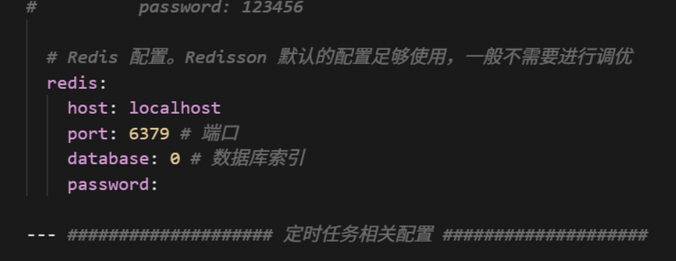

**Hadoop配置(`backend\yudao-module-system\yudao-module-system-biz\src\main\java\cn\iocoder\yudao\module\system\service\hadoopfile\HadoopFileServiceImpl.java`)**

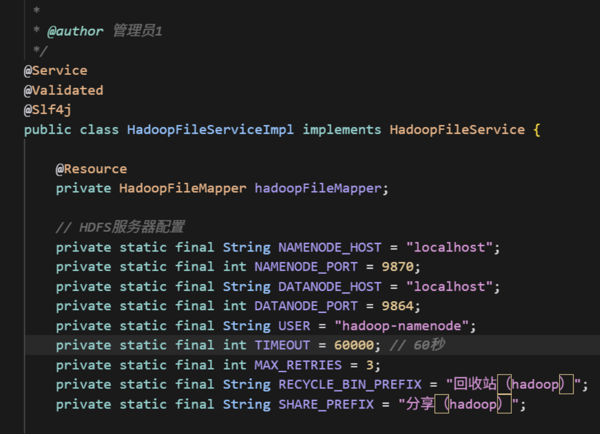

## 🌟 主要功能

### 📁 文件管理
- **上传下载**：支持单文件/批量文件上传下载，进度实时显示
- **文件夹操作**：创建文件夹、文件夹嵌套浏览
- **文件操作**：重命名、移动、删除、复制等基础操作
- **搜索功能**：按文件名进行快速搜索
- **多视图模式**：支持列表视图和网格视图切换

### 🔗 分享功能
- **一键分享**：生成分享链接，支持单文件和批量分享
- **分享管理**：查看分享状态，支持取消分享
- **分享访问**：通过分享链接快速访问和下载文件

### 🗂️ 文件分类
- **智能分类**：按文件类型自动分类（图片、文档、音频、视频等）
- **格式支持**：支持常见的所有文件格式
- **类型图标**：不同文件类型显示对应图标

### 🛡️ 安全特性
- **回收站**：删除文件进入回收站，支持恢复和彻底删除
- **权限控制**：用户登录验证，文件访问权限管理
- **数据加密**：敏感数据传输加密处理

### 📊 实时状态
- **上传进度**：实时显示上传进度和状态
- **下载管理**：下载任务管理和进度跟踪
- **操作反馈**：所有操作都有明确的成功/失败反馈

### 🎨 用户体验
- **响应式设计**：适配桌面端和移动端
- **主题风格**：现代化UI设计，操作简洁直观
- **快捷操作**：右键菜单、快捷键支持
- **面包屑导航**：清晰的路径导航

## 🖼️ 界面预览

> 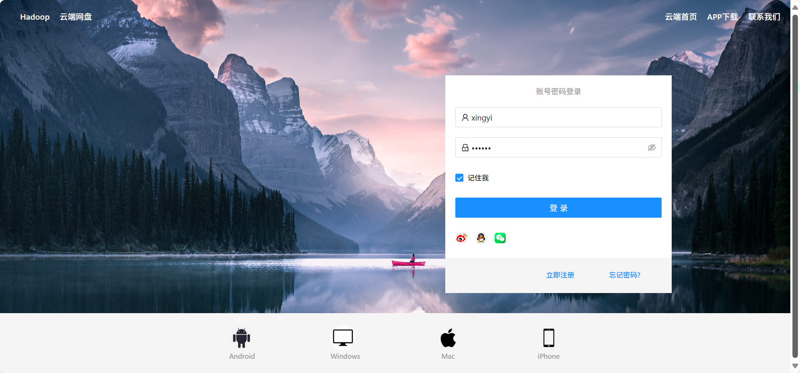
>
> 
>
> 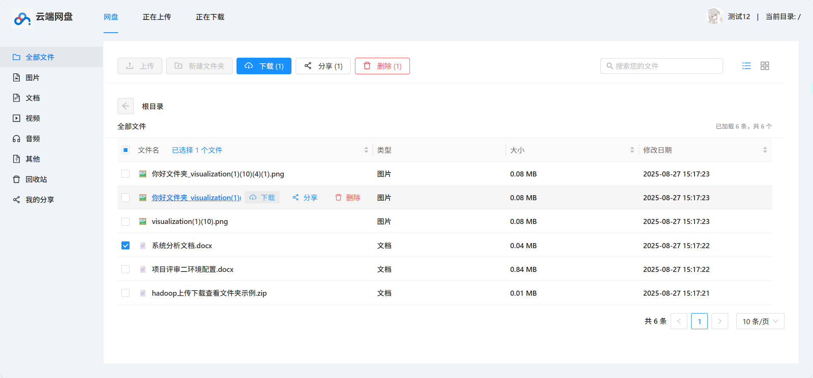
>
> 
>
> 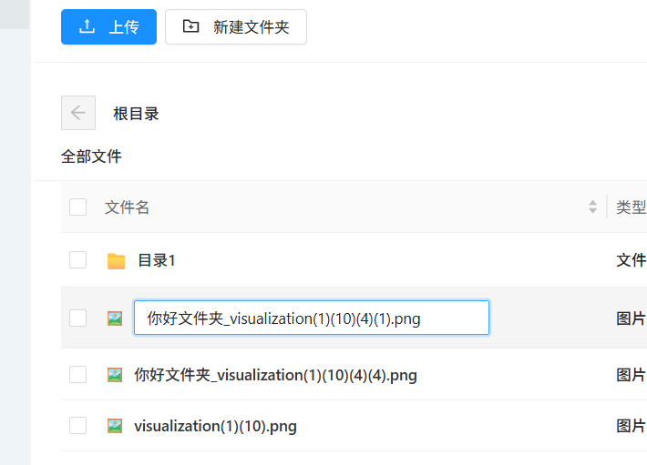
>
> 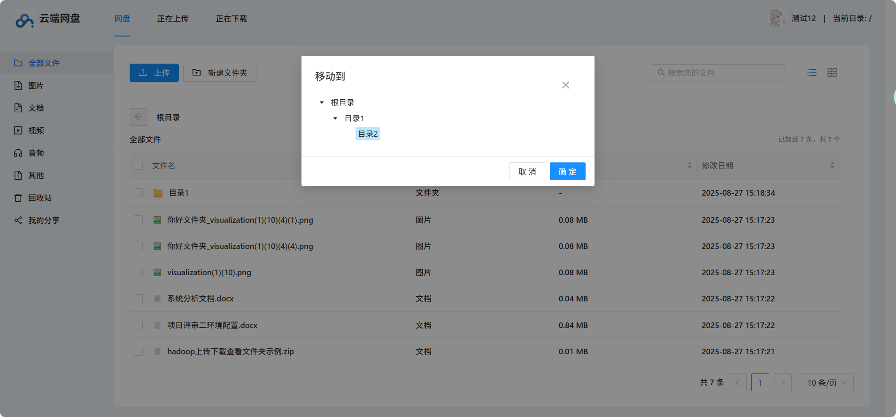
>
> 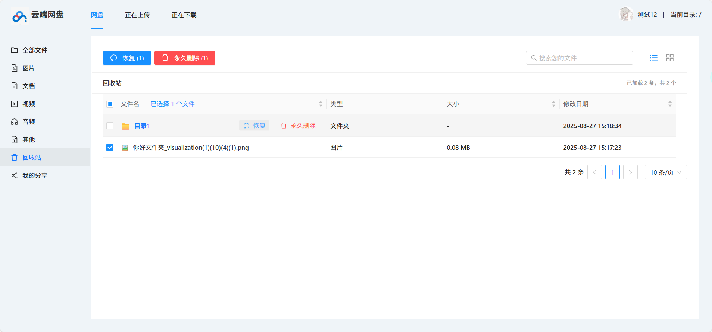
>
> 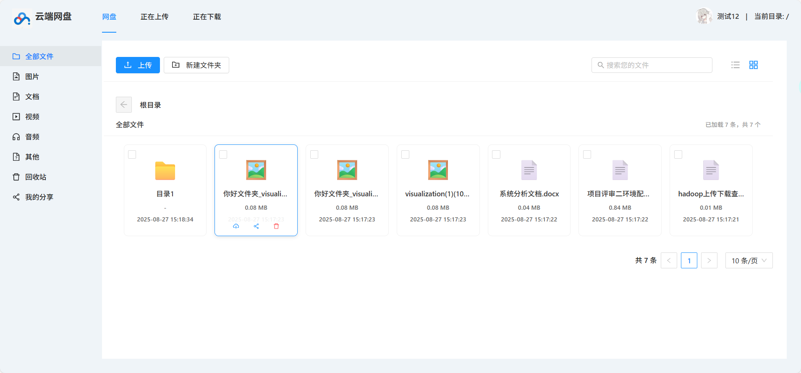
>
> 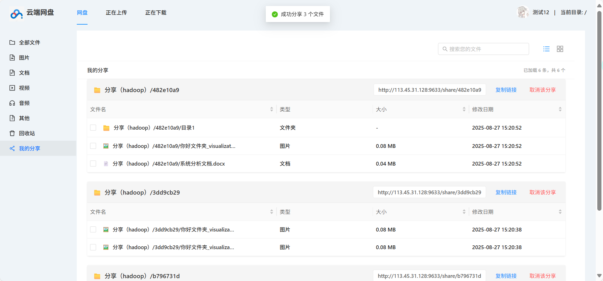
>
> 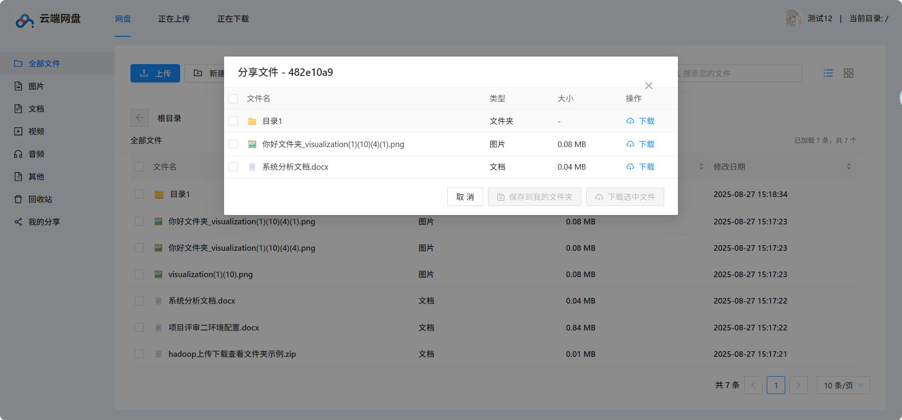
>
> 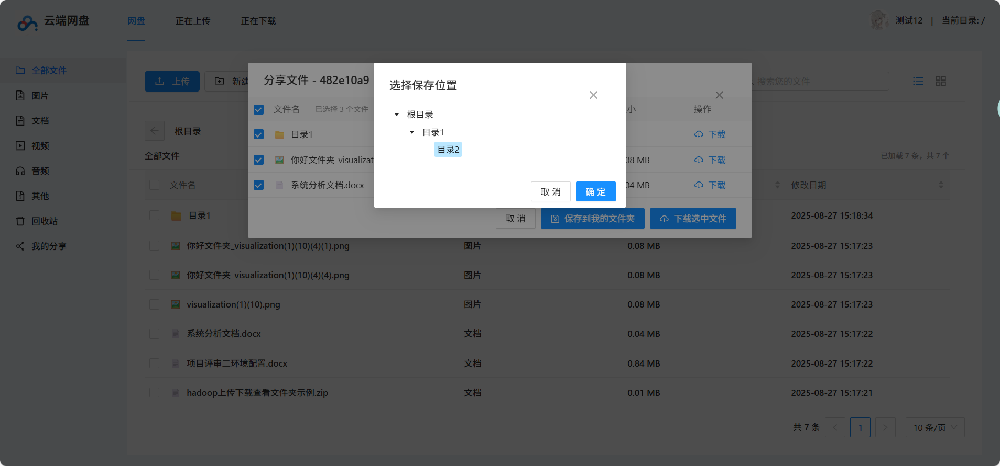
>
> 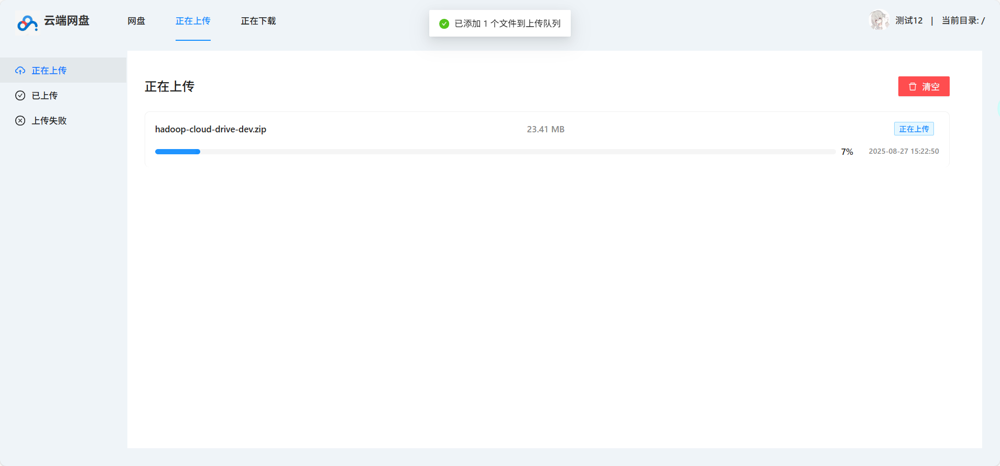
>
> 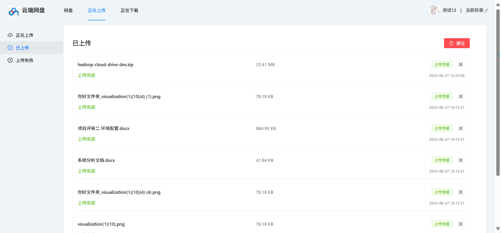
>
> 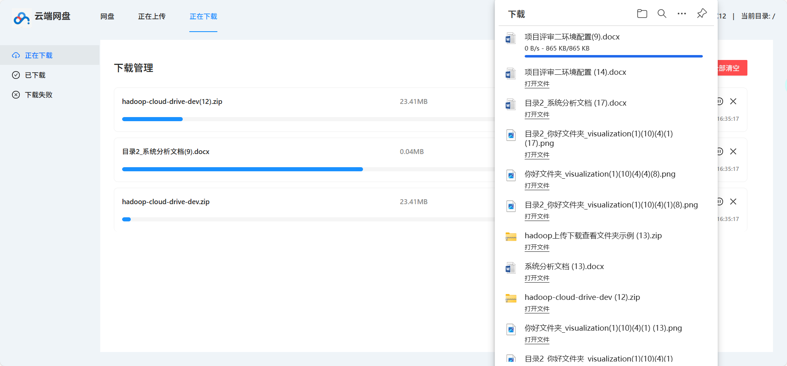
>
> 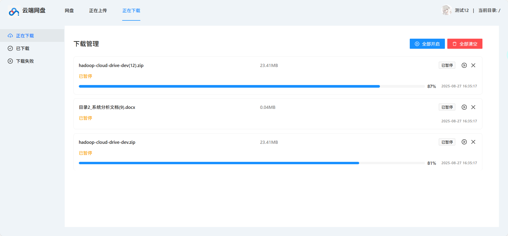
>
> 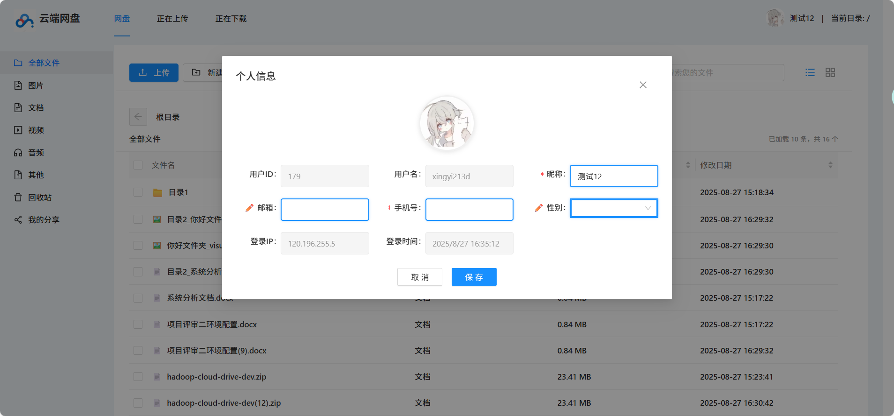
>
> 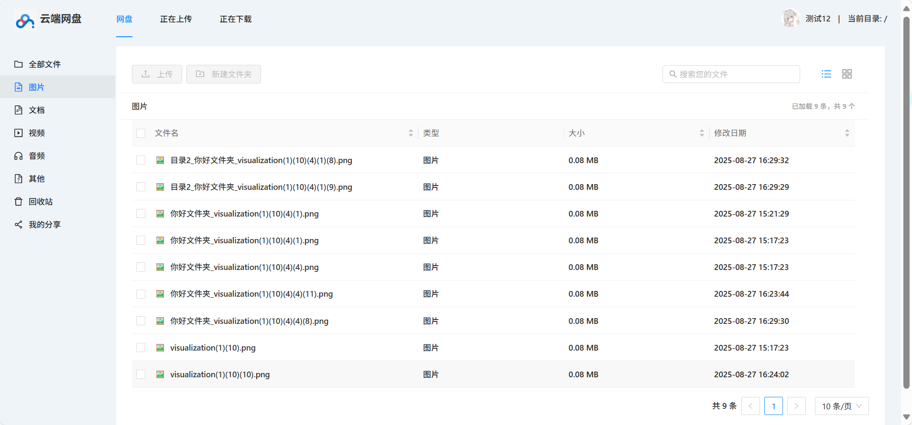
>
> 

### 主界面功能
- 清晰的文件列表展示
- 直观的操作按钮和状态显示
- 现代化的UI设计风格
- 响应式布局适配

### 文件管理界面
- 多种视图模式切换
- 文件分类和搜索功能
- 批量操作支持
- 实时进度反馈

## 🚧 开发计划

### 已完成功能 ✅
- [x] 基础文件上传下载
- [x] 文件夹管理
- [x] 文件分享功能
- [x] 回收站机制
- [x] 多视图展示
- [x] 搜索功能

### 规划中功能 📋
- [ ] 文件预览功能
- [ ] 断点续传
- [ ] 文件版本管理
- [ ] 批量压缩下载
- [ ] 移动端APP
- [ ] 文件同步功能

## 🤝 贡献指南

我们欢迎所有形式的贡献！请参考以下步骤：

1. **Fork** 项目
2. 创建功能分支 (`git checkout -b feature/AmazingFeature`)
3. 提交更改 (`git commit -m 'Add some AmazingFeature'`)
4. 推送到分支 (`git push origin feature/AmazingFeature`)
5. 开启 **Pull Request**

### 开发规范
- 遵循现有代码风格
- 添加适当的注释
- 编写单元测试
- 更新相关文档

## 📄 许可证

本项目基于 MIT 许可证开源 - 查看 [LICENSE](LICENSE) 文件了解详情

## 👥 维护者

- 项目维护团队

## 🙏 鸣谢

- 感谢 [芋道源码](https://github.com/YunaiV/ruoyi-vue-pro) 提供的优秀基础框架
- 感谢 [Ant Design](https://ant.design/) 提供的优秀UI组件库
- 感谢 [Apache Hadoop](https://hadoop.apache.org/) 提供的分布式存储方案
- 感谢所有为开源社区做出贡献的开发者们！

---

<div align="center">
⭐️ 如果这个项目对你有帮助，请给我们一个 Star！
</div>
